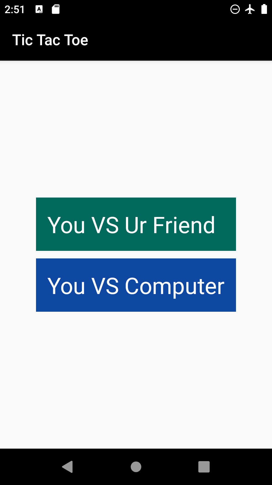
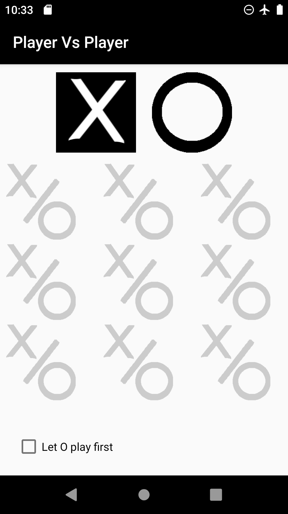
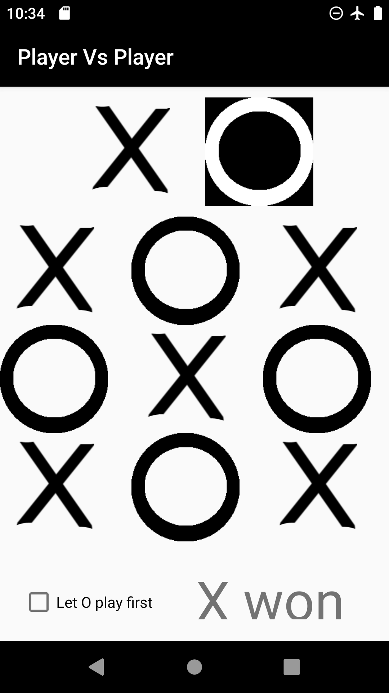
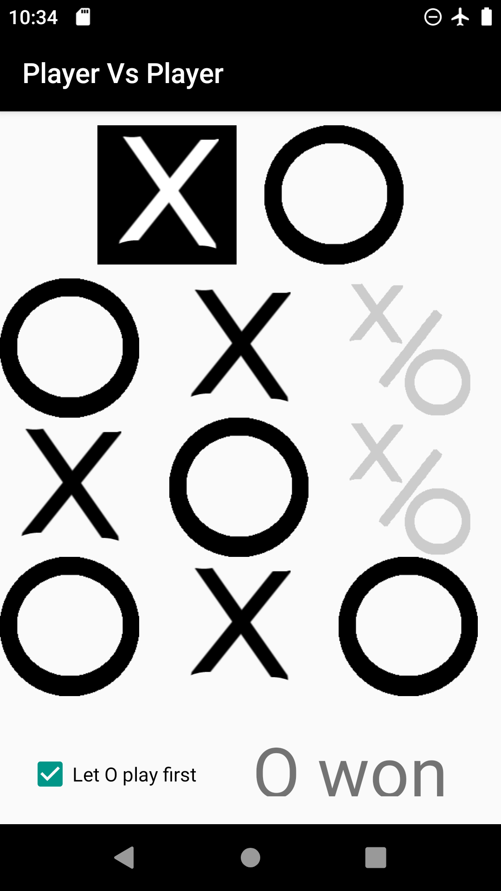
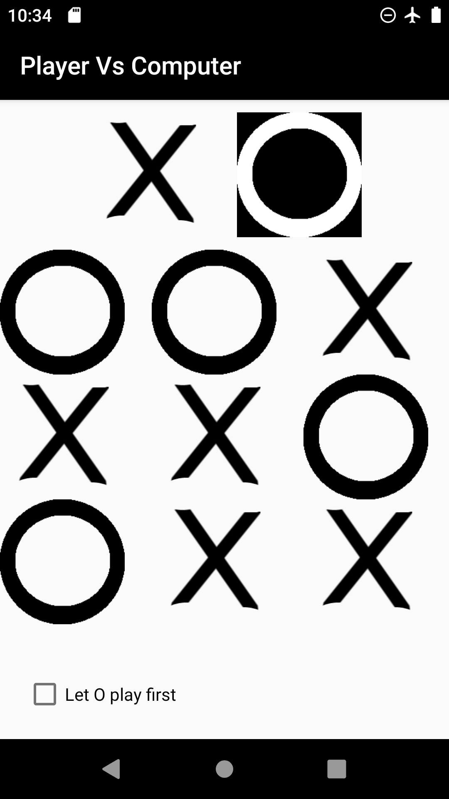

# Introduction 
Tic Tac Toe is a game that both competitors are trying to get three x or o in horizontal, vertical or diagonal.
There are two options either plays with your friend or plays with computer.

## Index
   1. We will start with [how does it work even if Player Vs Player or Player Vs Computer](#how-does-it-works)
   2. Then transfer to [how to use or run the app](#how-to-run-the-program) 

## How does it works?

* If played against your friend. You will have 9 possibilities and while anyone play the possibilities decreases one, this happen by making an array and put the poistion in it, and before each play check if the poistion is free or not. If anyone has won the boolean iswon will be true, then I have made a conditoin `if(!iswon) print 'the game was ended'`.Hence, if someone won then the game will stop otherwise the game will continue and you can choose any position as long as no one has played in it.
        I have used Grid View to make it a less memory usage.
 
        

    
    
    

 

- If played against the computer. The same as against player but here the computer tries not to loss and win if can. Each turn check if it has two horizontal or two vertical or diagonal and the third is empty. If not, check if the x has two horizontal or two vertical or diagonal and the third is empty.
  
      
    
## How to run the program
You can download it from the [store](https://www.amazon.com/gp/product/B08JJPZTPD)
or download it from github and use android studio to run it in your machine(either your mobile or virtual machine(emulator)).

#### Thanks to [Udacity Nano-degree](https://www.udacity.com/course/android-developer-nanodegree-by-google--nd801)

